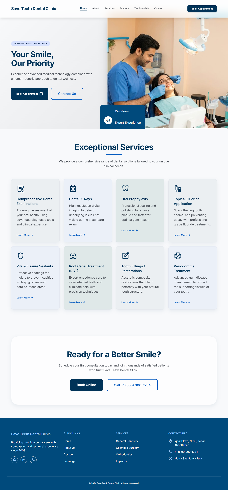
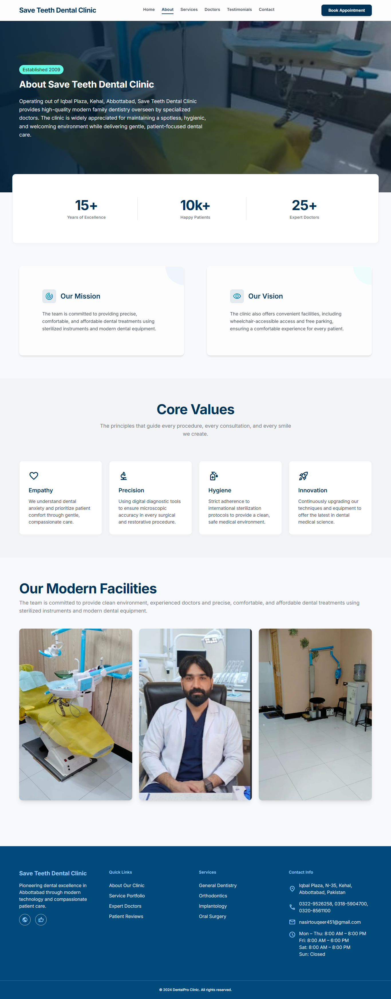
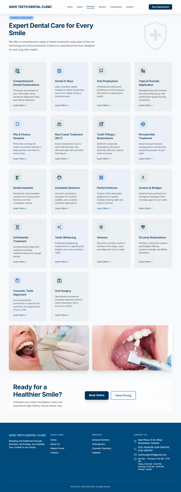
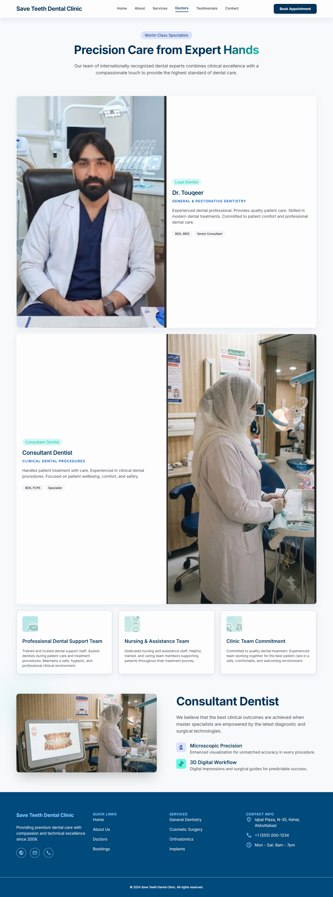
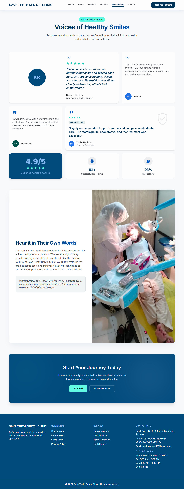
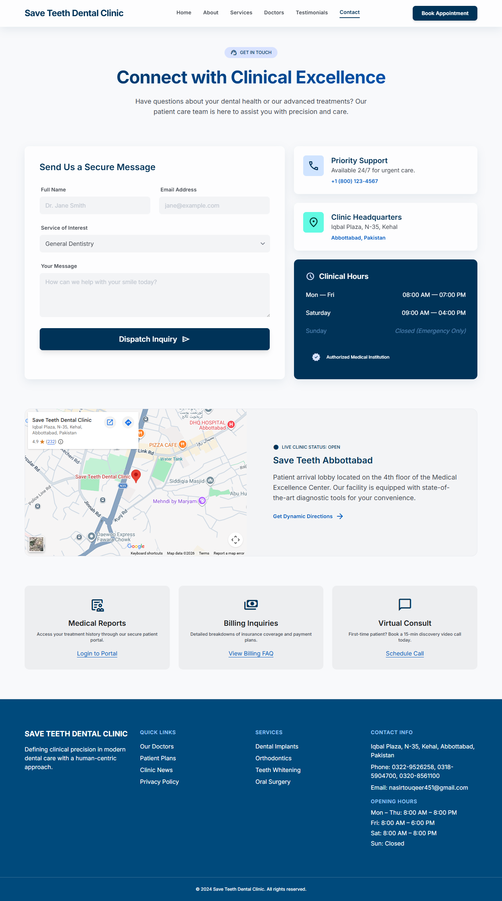
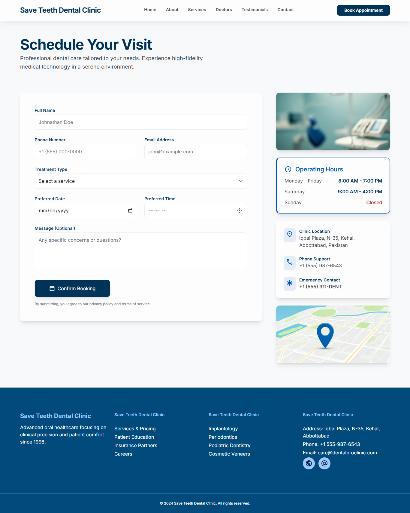

# 🦷 Save Teeth Dental Clinic

A modern, responsive multi-page website developed for **Save Teeth Dental Clinic**, a dental healthcare clinic located in **Iqbal Plaza, N-35, Kehal, Abbottabad**. The website is designed to establish a professional online presence for the clinic by providing essential information about its services, doctors, patient testimonials, contact details, and appointment booking.

This project was developed as a frontend web development project using HTML, Tailwind CSS, and JavaScript, with a strong focus on responsive design, clean user experience, and modern UI principles.

## 🌐 Live Demo

https://sehrish-web209.github.io/Save-Teeth-Dental-Clinic-/

## 🏥 About the Clinic

**Save Teeth Dental Clinic** is dedicated to providing high-quality dental care in a comfortable and patient-friendly environment. Led by **Dr. Touqeer** and supported by experienced consultants, the clinic offers preventive, restorative, and cosmetic dental treatments while focusing on patient comfort, oral health, and long-term care.

**Location:** Iqbal Plaza, N-35, Kehal, Abbottabad

## 📸 Screenshots

### 🏠 Home Page

### ℹ️ About Page

### 🦷 Services Page

### 👨‍⚕️ Doctors Page

### ⭐ Testimonials Page

### 📞 Contact Page

### 📅 Appointment Page

## ✨ Features

* Modern and responsive multi-page website
* Clean and professional dental clinic interface
* Fully responsive design for desktop, tablet, and mobile devices
* Dedicated pages for services, doctors, testimonials, and contact information
* Online appointment booking page
* Smooth scrolling and subtle UI animations
* Consistent design system with reusable components
* Professional typography and Material Symbols icons
* Organized project structure for easy maintenance

## 🛠️ Tech Stack

* HTML5
* Tailwind CSS (CDN)
* Vanilla JavaScript
* Google Fonts (Inter)
* Material Symbols

## 📂 Project Structure

Save-Teeth-Dental-Clinic/
│
├── assets/
│   ├── Clinic interior.jpg
│   ├── hero.jpg
│   └── ...
│
├── Screenshots/
│   ├── home-page.png
│   ├── about-page.png
│   ├── services-page.png
│   ├── doctors-page.png
│   ├── testimonials-page.png
│   ├── contact-page.png
│   └── appointment-page.png
│
├── index.html
├── About.html
├── Services.html
├── Doctors.html
├── Testimonials.html
├── Contact.html
├── Appointment.html
└── README.md

## 🚀 Getting Started

Clone the repository:

git clone https://github.com/Sehrish-web209/Save-Teeth-Dental-Clinic-.git

Open the project folder:

cd Save-Teeth-Dental-Clinic-

Run the project by opening **index.html** in your browser, or use the **VS Code Live Server** extension for a better development experience.

## 🌍 Deployment

This project is deployed using **GitHub Pages**.

Live Website:
https://sehrish-web209.github.io/Save-Teeth-Dental-Clinic-/

## 👩‍💻 Developer

**Sehrish Maqbool**

BS Information Technology (7th Semester)

GitHub: https://github.com/Sehrish-web209

